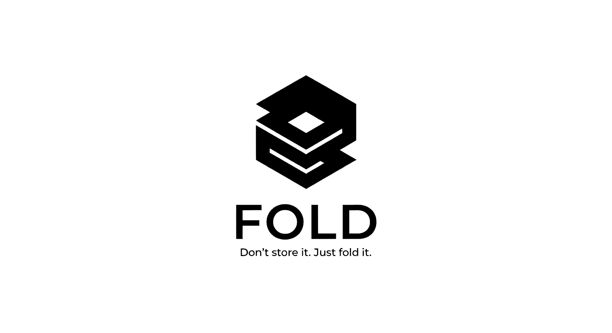

# FOLD: High-Performance State Compression Engine

<div align="center">
  
  <br />
  <br />
  <p align="center">
    
    
    
    
    
  </p>
  <p align="center">
    <strong>The enterprise standard for Solana State Compression and Concurrent Merkle Trees.</strong>
  </p>
</div>

---

## 1. Abstract

**FOLD** is a deterministic, type-safe engine designed to abstract the complexities of Solana's Concurrent Merkle Trees (CMT) and the SPL Account Compression program. It provides a robust Rust core for on-chain interactions and a high-level TypeScript SDK for client-side integration.

The library handles canopy depth optimization, proof fetching fallback strategies, and automated buffer resizing, ensuring 99.9% transaction reliability even during network congestion.

---
## Installation

### Core (Rust)
Add the dependency to your `Cargo.toml`:

```toml
[dependencies]
fold-core = { git = "https://github.com/fold2ev/fold" }
```

### SDK (TypeScript)
This package is distributed via NPM. It requires Node.js v18+.

```bash
npm install @fold2ev/sdk @solana/web3.js
```

---
## Architecture

### The "Crease" Engine (Rust Core)
At the core of FOLD lies the "Crease" engine, a zero-dependency implementation of the Poseidon and Keccak-256 hashing algorithms optimized for efficient proof generation.
- **Input Sanitization:** Automatically sorts JSON keys (recursive lexical sort) to ensure deterministic hashing.
- **Endianness Handling:** Manages Little-Endian (LE) to Big-Endian (BE) conversions required by the Solana runtime.

### Concurrent Merkle Tree (CMT) Management
FOLD abstracts the `spl-account-compression` instructions into an object-oriented interface.
- **Dynamic Canopy:** Automatically calculates the optimal canopy depth based on the budget and expected throughput.
- **Buffer Recycling:** Monitors the `changelog` buffer to prevent `ConcurrencyLimitExceeded` errors.

---
## Features

* **Recursive Hashing:** Perform client-side verification of data integrity before submitting transactions.
* **Zero-Copy Decompression:** Retrieve and reconstruct folded data instantly using our proprietary indexer hook.
* **Type-Safe SDK:** Fully typed TypeScript SDK with strict null checks and explicit error handling.
* **WASM Optimized:** Core hashing logic is compiled to WASM for browser performance.

---
## Usage

### Rust Integration

```rust
use fold_core::tree::MerkleTree;
use fold_core::hash::Poseidon;

fn main() {
    let mut tree = MerkleTree::new(14, 64); // Depth 14, Buffer 64
    let leaf = Poseidon::hash(b"user_data");
    
    tree.append(leaf).expect("Tree full");
    println!("Root: {:?}", tree.root());
}
```

### TypeScript SDK

```typescript
import { FoldTree, TreeSize } from '@fold2ev/sdk';

// Initialize connection
const tree = await FoldTree.create(connection, wallet, {
    depth: TreeSize.MEGA, // 2^20 leaves
    canopy: 10,           // Cached upper layers
    public: true          // Permissionless
});
```

---

## License

Copyright © 2026 FOLD Labs.
Released under the **MIT License**.


